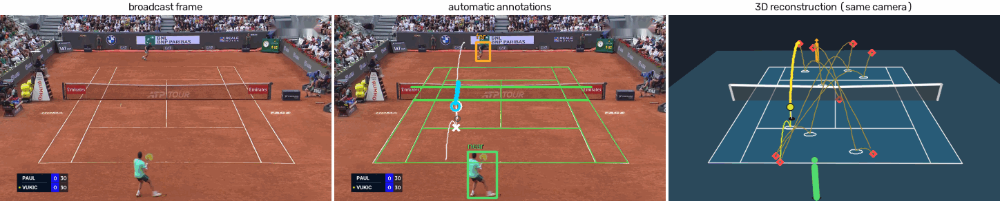
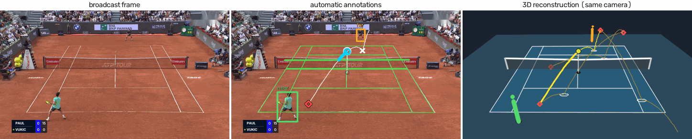
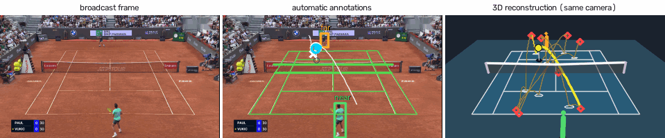

# OpenHawk: physics-based 3D tennis tracking from broadcast video

Automatic reconstruction of 3D tennis ball flights, events and player positions from a single
ordinary broadcast video. A match video file goes in. Out comes, for every point the pipeline can
support, the fitted 3D ball flight between consecutive racket contacts and bounces, in metres in
the court frame. There are no labels, no manual steps and no agent in the loop at inference.

This repository is the code release for the research paper *OpenHawk: Physics-Based 3D Tennis
Tracking from Broadcast Video*; OpenHawk is also the name of the released dataset. It is a
**snapshot** of the automatic path of a larger private research repository. It is research
code: it is written to be read and rerun, not packaged as a library. Released data will be
*processed outputs only* (3D flights, events, player positions, match metadata). No video is
distributed; the [samples](#samples) below are a few reduced single frames shown only to
illustrate the output.

## How it works

```text
broadcast video (1080p; native frame timestamps kept end to end)
 │
 ├─ source check ....... full decoded-timestamp audit and repeated-frame (cadence) check;
 │                       a broken timeline is refused, never re-timed by guesswork
 ├─ S1 points .......... view classifier + serve detector + audio + scoreboard reading
 │                       → ledger of serve attempts / rallies with times and score
 ├─ S2 court/camera .... court-line topology → per-frame camera (homography + height)
 ├─ S3 players ......... person detection and pose, near/far side association, court positions
 ├─ S4 2D ball ......... WASB + TrackNetV2 detectors (full frame, native far-court crops,
 │                       fine-tuned crop refinement), sub-pixel decoding, motion association
 ├─ S5 events .......... 3D-CNN video model over native crops + audio + track context
 │                       → racket contacts, bounces, net hits with sub-frame times
 └─ S6 3D fit .......... whole-point physical fit per rally: one ball, drag + Magnus flight with
     │                   a free 3-component spin per flight, measured court bounce law, net;
     │                   anchored on contacts and bounces; flight and point gates; abstains
     ├─ adjudication ... uncertain events are offered to the fitter and kept only if the
     │                   refit's physics gates accept them (no model call, $0)
     └─ assemble ....... MATCH_RESULT.json: accepted 3D flights, events, point-end call,
                         provenance (code, inputs, bounce law), time and cost per step
```

The physics is described in [docs/PHYSICS.md](docs/PHYSICS.md); the output format in
[docs/DATA_SCHEMA.md](docs/DATA_SCHEMA.md); how yield is scored in
[docs/EVALUATION.md](docs/EVALUATION.md); model weights in [docs/MODELS.md](docs/MODELS.md).

## Samples

One mid-rally instant from each of two rallies of one broadcast. Left: the broadcast frame.
Middle: the automatic annotations (projected court, 2D ball detections, players, detected
events and the reprojected fitted flight). Right: the fitted 3D reconstruction rendered through
the same fitted broadcast camera. Every mark is automatic output; nothing was labelled or
corrected by hand. Frames are reduced in size, and an on-screen logo over the crowd was
inpainted out. In the 3D panel the rally's other accepted flights are drawn thin, contacts are
red diamonds, bounces white rings, and players upright markers at their automatic court
positions (this run has no pose output).





Three seconds of rally 1 (every fourth native frame):



## Where to start reading

| file | what it is |
|---|---|
| `cv/pipeline/product_runner.py` | one broadcast in, `MATCH_RESULT.json` out; the entry point |
| `cv/pipeline/broadcast_runner.py` | upstream stages S1-S5 and the shared S6 backend |
| `cv/pipeline/s6_broadcast_backend.py`, `s6_attempt_execution.py` | per-attempt 3D fitting |
| `cv/pipeline/product_s6_policy.json` | the production fitting policy (every switch explicit) |
| `cv/experiments/connected_shooting/` | the S6 whole-point fitter itself (search, seeds, gates) |
| `cv/pipeline/event_cascade.py` | event adjudication (default: fitter, free) |
| `physics/flight.py`, `physics/bounce_reference.py`, `physics/impact.py` | flight ODE, measured bounce law, Cross slide/grip impact |
| `evaluation/origin_matcher.py` | the rule used to score reported yield |

`cv/experiments/connected_shooting/` keeps its research-history name: the product path imports
it directly, so it is included whole as far as the product imports reach.
[MANIFEST.md](MANIFEST.md) lists every included file with the reason it is here, and every
excluded group with the rule that excluded it.

## Install

Python 3.12+, `ffmpeg`/`ffprobe` on `PATH`, and a CUDA GPU for the upstream detectors
(developed on RTX PRO 6000 / RTX 5090 / RTX 3090 class cards). S6 fitting is CPU-bound.

```bash
python -m venv .venv && . .venv/bin/activate
pip install -e ".[cv,dev]"   # dependencies only; install the torch build for your CUDA first
export TENNIS_DATA_ROOT=/path/to/tennis-data   # weights and outputs; run commands from the repo root
```

Model weights are not in this repository; [docs/MODELS.md](docs/MODELS.md) lists each one, where
the code looks for it, and how to obtain it.

## Run on a video

```bash
python -m cv.pipeline.product_runner --video MATCH.mp4 --match-id KEY --surface hard \
    --out $TENNIS_DATA_ROOT/processed/runs/KEY --best-of 3 --gpu 0
```

Steps (`upstream`, `fit`, `cascade`, `refit`, `assemble`, `portal`) resume from their own
markers; rerun the same command after an interruption. `--until fit` stops after the first fits.
`--max-points N` fits only the first N attempts (smoke runs). Nothing reads evaluation labels
(`MATCH_RESULT.json` records `evaluation_labels_read: false`).

Measured on two full matches in development (one machine, 64 CPU cores + GPUs): 6-8 h wall,
24-31 CPU-hours and 1.3-3.7 GPU-hours per match, $0 in paid model calls with the default
adjudication. The paid VLM event cascade (Gemini Flash, then Claude Opus, via OpenRouter) is
kept as a rollback behind `--event-adjudication paid` with a hard dollar cap; it needs
`OPENROUTER_API_KEY` in the environment.

Tests: `pytest -q` (slow physics fits need `--runslow`). Unit tests use synthetic fixtures only.

## Results

The unit is the **flight**: one ball flight between two events. A labelled flight counts as
recovered when the pipeline accepts a 3D flight whose start matches the labelled racket-contact
origin (one-to-one, within two native frame periods; [docs/EVALUATION.md](docs/EVALUATION.md)).
Abstentions, refusals and failures stay in the denominator. **AA** = automatic ball and automatic
events (the product). **AL** = automatic ball with labelled events (a ceiling for event
detection). Labels are development ground truth from frontier VLM labellers (see below), not
Hawk-Eye.

| population | status | code | AA | AL | wrong accepts |
|---|---|---|---:|---:|---|
| Panel F, 9 broadcasts, 7 processed | **sealed**, measured once, no tuning | 2026-09-28 | **90/136 (66.2%)** | 116/136 (85.3%) | 0 (plus 4 post-point flights, 5 origin offsets) |
| same, counting the 2 refused broadcasts as misses | sealed | 2026-09-28 | 90/167 (53.9%) | 116/167 (69.5%) | as above |
| Panel D, 9 broadcasts incl. grass | sealed, earlier code | 2026-09-27 | 79/172 (45.9%) | 141/172 (82.0%) | 2 (+4 origin offsets) |
| Panel C | sealed, earlier code | 2026-09-26 | 28/77 (36.4%) | 51/77 (66.2%) | 0 |
| Panel F again, with fitter adjudication | development (opened after the sealed run) | 2026-09-28 | 93/136 (68.4%) | — | 8 unmatched accepts (unclassified) |
| Panels 0+A, fitter adjudication | development (opened, tuned on) | 2026-09-28 | 116/174 (66.7%) | — | 2 unmatched accepts (unclassified) |
| First fresh hold-out, before the sealed-panel protocol | history | 2026-09-20 | 9/102 (8.8%) | 23/102 | 0 |

Read these with the following in mind:

- **Sealed** means one measurement on broadcasts nobody had opened, with no reruns after
  results were seen. The three sealed panels were measured on successive code versions; they
  are not repeated draws of one system. A further sealed panel is reserved for the paper.
- Panel F refused 2 of 9 broadcasts by design (irregular frame cadence). Both rates are shown.
- "Wrong accept" is an accepted flight that matches no labelled flight and is not explained as
  a post-point flight (a player knocking a dead ball back, emitted but tagged `after_point_end`)
  or a correct flight whose start is offset from the label. Counting post-point flights as wrong,
  panel F has about 4 wrong per 90 accepted.
- Panel F labels were produced by Claude Opus 5.5. On panel C, Opus and GPT-6 Astra labels agreed
  on 97% of flight origins (75/77 recall, 75/79 precision).
- **This snapshot is newer than the panel F measurement.** Since then the default event
  adjudication changed from none to the free fitter adjudication (measured only on development
  panels: 465 vs 449 of 679 flights against the paid cascade, no new unmatched accepts), and
  the bounce law was refitted without the Hawk-Eye matches reserved for validation (<1% change).
- **The scores measure flight recovery, not 3D accuracy.** No independent 3D accuracy number
  exists yet. A point-by-point comparison against Hawk-Eye on 51 matches present in both our
  evaluation set and the public Hawk-Eye corpus is planned; the bounce law was fitted without
  those matches.
- Complete-point yield (every flight of a point accepted) is not yet reported.

## Limitations

- Monocular broadcast video: depth comes from the physics and the court/net geometry, and a
  gate-accepted fit is not certified 3D truth.
- Racket impacts are not modelled physically: each flight starts free at a contact anchor.
- Production bounces keep the incoming horizontal heading (Hawk-Eye shows sub-degree median
  lateral deflection); a 3D Coulomb bounce in which sidespin turns the rebound exists but is off.
- The per-flight rifle-spin component is weakly identified and often sits at its bound; fitted
  spin should be treated as a fitting parameter, not a measurement (docs/PHYSICS.md).
- Grass bounce parameters come from 11 impacts; the Hawk-Eye corpus has no grass.
- Broadcasts with irregular frame cadence are refused. Scoreboard reading needs a local VLM and
  abstains on some broadcasts. Player output is sparse (positions at contact time).
- Event detection is the main loss (AA vs AL above); the event model was trained on a few dozen
  broadcasts.

## Not in this repository

Videos, frames and any broadcast images; model weights (see docs/MODELS.md); human and VLM
labels; the evaluation-panel harness and panel data; internal experiment logs. Candidates for
release on request are listed in docs/MODELS.md and docs/EVALUATION.md.

## Trademark

Hawk-Eye is a registered trademark of Hawk-Eye Innovations Ltd. OpenHawk is an independent
project and is not affiliated with, sponsored by, or endorsed by Hawk-Eye Innovations.

## Licence and citation

Code: Apache License 2.0 ([LICENSE](LICENSE)). Third-party code, runtime dependency and model
licences: [NOTICE](NOTICE). Note that the player and pose detectors come from the Ultralytics
package, which is AGPL-3.0 and is installed separately under its own terms. Cite with
[CITATION.cff](CITATION.cff).
